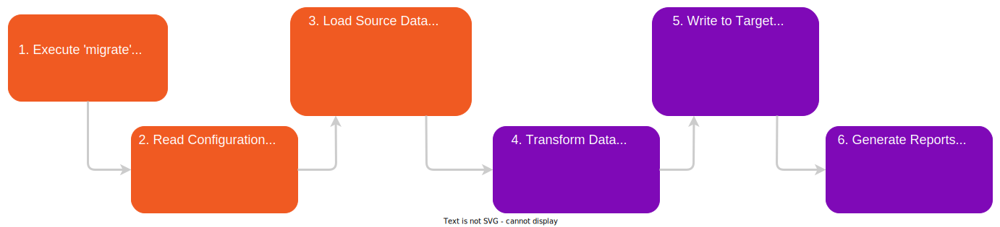

# Xperience by Kentico: Kentico Migration Tool

[![7-day bug-fix policy](https://img.shields.io/badge/-7--days_bug--fixing_policy-grey?labelColor=orange&logo=data:image/svg+xml;base64,PHN2ZyBjbGFzcz0ic3ZnLWljb24iIHN0eWxlPSJ3aWR0aDogMWVtOyBoZWlnaHQ6IDFlbTt2ZXJ0aWNhbC1hbGlnbjogbWlkZGxlO2ZpbGw6IGN1cnJlbnRDb2xvcjtvdmVyZmxvdzogaGlkZGVuOyIgdmlld0JveD0iMCAwIDEwMjQgMTAyNCIgdmVyc2lvbj0iMS4xIiB4bWxucz0iaHR0cDovL3d3dy53My5vcmcvMjAwMC9zdmciPjxwYXRoIGQ9Ik08ODguNDkgMjIyLjY4NnYtMzEuNTRsLTY1LjY3Mi0wLjk1NWgtMC4yMDVhNDY1LjcxNSA0NjUuNzE1IDAgMCAxLTE0NC4zMTUtMzEuMzM0Yy03Ny4wMDUtMzEuMTk4LTEyNi4yOTQtNjYuNzY1LTEyNi43MDMtNjcuMTA3bC0zOS44LTI4LjY3Mi0zOS4xODUgMjguNDY4Yy0yLjA0OCAxLjUwMS00OS45MDMgMzYuMDQ0LTEyNi45MDggNjcuMzFhNDQ3LjQyIDQ0Ny40MiAwIDAgMS0xNDQuNTIgMzEuMzM1bC02NS44NzcgMC45NTZ2Mzc4Ljg4YzAgODcuMDQgNDkuODM0IDE4NC42NjEgMTM3LjAxIDI2Ny44MSAzNy41NDcgMzUuODQgNzkuMjU4IDY2LjM1NSAxMjAuODMzIDg4LjIgNDMuMjggMjIuNzMzIDg0LjI0IDM0LjYxMiAxMTguODUyIDM0LjYxMiAzNC40MDYgMCA3NS43NzYtMTIuMTUyIDExOS42MDMtMzUuMTU4YTU0Ny45NzcgNTQ3Ljk3NyAwIDAgMCAxMjAuMDEzLTg3LjY1NCA1MTUuMjA5IDUxNS4yMDkgMCAwIDAgOTYuMTg4LTEyMi44OGMyNy4xMDItNDkuNTYyIDQwLjgyMy05OC4zMDQgNDAuODIzLTE0NC45OTlsLTAuMTM2LTM0Ny4yMDR6TTUxMC4wOSAxNDMuNDI4bDEuNzA2LTEuMzY1IDEuNzc1IDEuMzY1YzUuODAzIDQuMTY1IDU5LjUyOSA0MS44NDggMTQwLjM1NiA3NC43NTIgNzkuMTkgMzIuMDg2IDE1My42IDM1LjYzNSAxNjcuNjYzIDM2LjA0NWwyLjU5NCAwLjA2OCAwLjIwNSAzMTUuNzM0YzAuMTM3IDY5LjQ5NS00Mi41OTggMTUwLjE4Ni0xMTcuMDc3IDIyMS40NTdDNjQxLjU3IDg1NC4yODkgNTYzLjEzIDg5Ni40NzggNTEyIDg5Ni40NzhjLTIzLjY4OSAwLTU1LjU3LTkuODk5LTg5LjcwMi0yNy43ODVhNDc4LjgyMiA0NzguODIyIDAgMCAxLTEwNS42MDktNzcuMjc4QzI0Mi4yMSA3MjAuMjEzIDE5OS40NzUgNjM5LjUyMiAxOTkuNDc1IDU2OS44OVYyNTQuMjI1bDIuNzMtMC4xMzZjMy4yNzggMCA4Mi42MDQtMS41MDIgMTY3LjY2NC0zNS45NzdhNzM5Ljk0MiA3MzkuOTQyIDAgMCAwIDE0MC4yMi03NC42MTV2LTAuMDY5eiIgIC8+PHBhdGggZD0iTTcxMy4zMTggMzY4LjY0YTMyLjIyMiAzMi4yMjIgMCAwIDAtNDUuMzI5IDBMNDQ5LjE5NSA1ODcuNDM1bC05My4xODQtOTMuMTE2YTMyLjIyMiAzMi4yMjIgMCAwIDAtNDUuMzMgMCAzMi4yMjIgMzIuMjIyIDAgMCAwIDAgNDUuMjZsMTE1Ljg1IDExNS44NWEzMi4yOSAzMi4yOSAwIDAgMCA0NS4zMjggMEw3MTMuMzIgNDEzLjlhMzIuMjIyIDMyLjIyMiAwIDAgMCAwLTQ1LjMzeiIgIC8+PC9zdmc+)](https://github.com/Kentico/.github/blob/main/SUPPORT.md#full-support)

[](https://github.com/Kentico/xperience-by-kentico-kentico-migration-tool/actions/workflows/build.yml)

## Description

This repository is part of the [Xperience by Kentico Migration Toolkit](https://github.com/Kentico/xperience-by-kentico-migration-toolkit).

The Kentico Migration Tool transfers content and other data from **Kentico Xperience 13**, **Kentico 12** or **Kentico 11** to **Xperience by Kentico**.

The tool migrates data models and content only. Code migration is not supported. Migrations can be performed multiple times with built-in and custom data transformations.

## Complete Upgrade Documentation  

This repository contains the data migration tool and its technical reference documentation. For comprehensive guidance on upgrading from Kentico Xperience 13 to Xperience by Kentico, including planning, walkthroughs, and advanced techniques, see the [Learn portal upgrade guides](https://docs.kentico.com/x/migrate_from_kx13_guides).

**Quick Links:**

- [Upgrade overview](https://docs.kentico.com/x/migrate_from_kx13_overview_guides) - High-level overview of the upgrade process
- [Upgrades FAQ for architects and team leads](https://docs.kentico.com/x/upgrade_from_kx13_faq_guides) - Common questions and challenges
- [Plan your strategy](https://docs.kentico.com/x/plan_your_strategy_for_migrating_features_guides) - Feature comparison and effort estimation
- [Upgrade walkthrough](https://docs.kentico.com/x/upgrade_walkthrough_guides) - Hands-on tutorial with the Dancing Goat sample site
- [Advanced upgrade deep dives](https://docs.kentico.com/x/upgrade_deep_dives_guides) - Developer-focused guides for customizing migrations and handling complex scenarios

> [!IMPORTANT]
> When planning an upgrade, note special considerations for [deploying to production](https://docs.kentico.com/guides/upgrade-to-xbyk/upgrade-from-kx13/upgrade-faq#are-there-special-considerations-when-deploying-an-upgraded-project-to-production-for-the-first-time) and [deploying to SaaS](https://docs.kentico.com/guides/upgrade-to-xbyk/upgrade-from-kx13/upgrade-faq#are-there-special-considerations-when-performing-an-upgrade-using-xperience-by-kentico-saas).

## Technical Documentation (This Repository)

Technical reference documentation for configuring and running the migration tool:

| Document | Purpose |
|----------|---------|
| **[Migration CLI README](./Migration.Tool.CLI/README.md)** | Commands, configuration options, object-specific instructions |
| **[Supported Data](./docs/Supported-Data.md)** | Complete list of what can/cannot be migrated |
| **[Extensions README](./Migration.Tool.Extensions/README.md)** | How to create custom migrations |
| **[Repository Structure](./docs/Repository-Structure.md)** | Project organization, component relationships, codebase navigation |
| **[Contributing Setup](./docs/Contributing-Setup.md)** | For contributors to this tool |

## How Data Migration Works

The migration tool transfers data from source databases (K11/KX12/KX13) to Xperience by Kentico, transforming data structures as needed:



The migration follows six sequential steps:

1. **Execute CLI 'migrate' Command** - Initiates the process
2. **Read configuration** - Loads settings from appsettings.json
3. **Load source data** - Retrieves data from source database (K11/KX12/KX13), filesystem (media/attachments), and API (widget info for KX13)
4. **Transform Data** - Applies built-in mappers and custom migrations (field, widget, and class mappings)
5. **Write to target** - Uses [Universal Migration Tool](https://github.com/Kentico/xperience-by-kentico-universal-migration-tool) (primary), XbyK API, or Bulk SQL copy to recreate content and other data in your target Xperience by Kentico instance.
6. **Generate Reports** - Outputs console logs and log files

The migration tool is:
- **Iterative** - Supports multiple runs that update existing data without creating duplicates (UPSERT behavior)
- **Selective** - Migrates only specific data types using command parameters
- **Extensible** - Applies custom transformations for project-specific requirements

## How to Run the Kentico Migration Tool

### Prerequisites

Before running the migration, ensure you have:

- **Source instance** (K11/KX12/KX13) running and accessible
  - KX13 must be **Refresh 5 (hotfix 13.0.64) or higher**
- **Target Xperience by Kentico instance** set up and running
   - must be compatible with the version of migration tool (see [version compatibility matrix](#library-version-matrix))
- **[.NET 8.0 or newer](https://dotnet.microsoft.com/en-us/download/dotnet) SDK** installed
- **Kentico Migration Tool source code** cloned or downloaded from this repository

   > [!NOTE]
   > We recommend to maintain a separate copy of the Migration Tool per project to keep project-specific configurations and customizations isolated.

> **Need help with instance setup?** The [Migration CLI README](./Migration.Tool.CLI/README.md) provides detailed instructions for configuring both source and target instances.

### Running Your First Migration

For a lift-and-shift migration, use the migration tool's default configuration:

1. **Set up your instances** - Ensure both source and target instances are accessible. The source instance must be running. The target instance must not be running.

2. **Configure connections** - Update `appsettings.json` in the `Migration.Tool.CLI` project with database connection strings.

3. **Build the solution** - Open `Migration.Tool.sln` in your IDE and build in Release mode for optimal performance. (Use Debug mode when developing custom migrations or troubleshooting issues.)

4. **Run the migration** - Navigate to the output directory and execute the CLI tool:
   ```powershell
   cd .\Migration.Tool.CLI\bin\Release\net8.0
   .\Migration.Tool.CLI.exe migrate --sites --users --page-types --pages
   ```

   For a complete migration with all data types:
   ```powershell
   .\Migration.Tool.CLI.exe migrate
   --sites --custom-modules --users --settings-keys --page-types --pages --type-restrictions --contact-management --forms --media-libraries --data-protection --custom-tables --members --categories
   ```

5. **Review results** - Check console [output and log files](./Migration.Tool.CLI/README.md#logging) for issues or manual steps:
   - **Console** shows real-time progress and results
   - **Log files** capture detailed execution logs (`logs\log-<date>.txt`)

> [!NOTE]
> **What gets migrated?** See [Supported Data](./docs/Supported-Data.md) for a complete list of data types and any limitations.

> [!TIP]
> **First-time user?** See the **[Migration CLI Setup Guide](./Migration.Tool.CLI/README.md)** for detailed instructions on configuring source and target instances, understanding `appsettings.json` options, and command parameters.
>
>
> **Learning by doing?** Follow our [Upgrade Walkthrough](https://docs.kentico.com/x/upgrade_walkthrough_guides) - a step-by-step, code-along guide using the Dancing Goat sample site. The guide covers both data migration and code adjustments to display a Kentico Xperience 13 page seamlessly in Xperience by Kentico.

### When You Need Customization

The migration tool handles standard data transformations automatically. However, you may need to customize the migration process for:

1. **Project-specific custom implementations** - When migrating custom field types, Page Builder widgets with non-standard properties, or custom modules/tables requiring specialized data handling
2. **Content model optimization** - When restructuring your content to better align with Xperience by Kentico architecture, such as converting web pages to reusable content items, flattening hierarchical structures, or transforming Page Builder widget data

To understand when and how to implement customizations:

1. Review the [Repository Structure](./docs/Repository-Structure.md) to understand how the migration tool components interact.
2. Consult the [Extensions Guide](./Migration.Tool.Extensions/README.md) for detailed instructions on customizing migration.

## Library Version Matrix

View all [project releases](https://github.com/Kentico/xperience-by-kentico-kentico-migration-tool/releases/).

| Xperience Version | Library Version |
| ------------------| ----------------|
| >= 31.0.0         | >= 4.0.0        |
| >= 30.12.0        | >= 3.20.0       |
| >= 30.11.0        | >= 3.18.0       |
| >= 30.10.1        | >= 3.16.0       |
| >= 30.8.0         | >= 3.12.0       |
| >= 30.6.0         | >= 3.8.0        |
| >= 30.5.1         | >= 3.6.0        |
| >= 30.4.0         | >= 3.4.0        |
| >= 30.3.1         | >= 3.3.0        |
| >= 30.2.0         | >= 3.0.0        |
| >= 30.1.1         | >= 2.3.0        |
| >= 30.0.0         | >= 2.0.0        |
| >= 29.7.0         | >= 1.6.0        |
| >= 29.6.0         | >= 1.4.0        |
| >= 29.5.2         | >= 1.3.0        |
| >= 29.3.3         | >= 1.2.0        |
| >= 29.2.0         | >= 1.1.0        |
| >= 29.1.0         | >= 1.0.0        |

## Dependencies

- [ASP.NET Core 8.0](https://dotnet.microsoft.com/en-us/download)
- [Xperience by Kentico](https://docs.kentico.com/changelog)

## Contributing

When [creating an issue](https://github.com/Kentico/xperience-by-kentico-kentico-migration-tool/issues/new), provide all available information about the problem or error. Include the command line output log file generated by the `Migration.Tool.CLI.exe migrate` command when possible.

For guidelines on contributing to Kentico open source software, see [Kentico's `CONTRIBUTING.md`](https://github.com/Kentico/.github/blob/main/CONTRIBUTING.md) and follow [Kentico's `CODE_OF_CONDUCT`](https://github.com/Kentico/.github/blob/main/CODE_OF_CONDUCT.md).

Instructions and technical details for **contributing to this project** can be found in [Contributing Setup](./docs/Contributing-Setup.md).

## License

Distributed under the MIT License. See [`LICENSE.md`](./LICENSE.md) for more information.

## Support

[![7-day bug-fix policy](https://img.shields.io/badge/-7--days_bug--fixing_policy-grey?labelColor=orange&logo=data:image/svg+xml;base64,PHN2ZyBjbGFzcz0ic3ZnLWljb24iIHN0eWxlPSJ3aWR0aDogMWVtOyBoZWlnaHQ6IDFlbTt2ZXJ0aWNhbC1hbGlnbjogbWlkZGxlO2ZpbGw6IGN1cnJlbnRDb2xvcjtvdmVyZmxvdzogaGlkZGVuOyIgdmlld0JveD0iMCAwIDEwMjQgMTAyNCIgdmVyc2lvbj0iMS4xIiB4bWxucz0iaHR0cDovL3d3dy53My5vcmcvMjAwMC9zdmciPjxwYXRoIGQ9Ik04ODguNDkgMjIyLjY4NnYtMzEuNTRsLTY1LjY3Mi0wLjk1NWgtMC4yMDVhNDY1LjcxNSA0NjUuNzE1IDAgMCAxLTE0NC4zMTUtMzEuMzM0Yy03Ny4wMDUtMzEuMTk4LTEyNi4yOTQtNjYuNzY1LTEyNi43MDMtNjcuMTA3bC0zOS44LTI4LjY3Mi0zOS4xODUgMjguNDY4Yy0yLjA0OCAxLjUwMS00OS45MDMgMzYuMDQ0LTEyNi45MDggNjcuMzFhNDQ3LjQyIDQ0Ny40MiAwIDAgMS0xNDQuNTIgMzEuMzM1bC02NS44NzcgMC45NTZ2Mzc4Ljg4YzAgODcuMDQgNDkuODM0IDE4NC42NjEgMTM3LjAxIDI2Ny44MSAzNy41NDcgMzUuODQgNzkuMjU4IDY2LjM1NSAxMjAuODMzIDg4LjIgNDMuMjggMjIuNzMzIDg0LjI0IDM0LjYxMiAxMTguODUyIDM0LjYxMiAzNC40MDYgMCA3NS43NzYtMTIuMTUyIDExOS42MDMtMzUuMTU4YTU0Ny45NzcgNTQ3Ljk3NyAwIDAgMCAxMjAuMDEzLTg3LjY1NCA1MTUuMjA5IDUxNS4yMDkgMCAwIDAgOTYuMTg4LTEyMi44OGMyNy4xMDItNDkuNTYyIDQwLjgyMy05OC4zMDQgNDAuODIzLTE0NC45OTlsLTAuMTM2LTM0Ny4yMDR6TTUxMC4wOSAxNDMuNDI4bDEuNzA2LTEuMzY1IDEuNzc1IDEuMzY1YzUuODAzIDQuMTY1IDU5LjUyOSA0MS44NDggMTQwLjM1NiA3NC43NTIgNzkuMTkgMzIuMDg2IDE1My42IDM1LjYzNSAxNjcuNjYzIDM2LjA0NWwyLjU5NCAwLjA2OCAwLjIwNSAzMTUuNzM0YzAuMTM3IDY5LjQ5NS00Mi41OTggMTUwLjE4Ni0xMTcuMDc3IDIyMS40NTdDNjQxLjU3IDg1NC4yODkgNTYzLjEzIDg5Ni40NzggNTEyIDg5Ni40NzhjLTIzLjY4OSAwLTU1LjU3LTkuODk5LTg5LjcwMi0yNy43ODVhNDc4LjgyMiA0NzguODIyIDAgMCAxLTEwNS42MDktNzcuMjc4QzI0Mi4yMSA3MjAuMjEzIDE5OS40NzUgNjM5LjUyMiAxOTkuNDc1IDU2OS44OVYyNTQuMjI1bDIuNzMtMC4xMzZjMy4yNzggMCA4Mi42MDQtMS41MDIgMTY3LjY2NC0zNS45NzdhNzM5Ljk0MiA3MzkuOTQyIDAgMCAwIDE0MC4yMi03NC42MTV2LTAuMDY5eiIgIC8+PHBhdGggZD0iTTcxMy4zMTggMzY4LjY0YTMyLjIyMiAzMi4yMjIgMCAwIDAtNDUuMzI5IDBMNDQ5LjE5NSA1ODcuNDM1bC05My4xODQtOTMuMTE2YTMyLjIyMiAzMi4yMjIgMCAwIDAtNDUuMzMgMCAzMi4yMjIgMzIuMjIyIDAgMCAwIDAgNDUuMjZsMTE1Ljg1IDExNS44NWEzMi4yOSAzMi4yOSAwIDAgMCA0NS4zMjggMEw3MTMuMzIgNDEzLjlhMzIuMjIyIDMyLjIyMiAwIDAgMCAwLTQ1LjMzeiIgIC8+PC9zdmc+)](https://github.com/Kentico/.github/blob/main/SUPPORT.md#full-support)

This project has **Full support by 7-day bug-fix policy**:

- Bug fixes are applied to the latest version only (no backporting to previous releases)
- The Migration Tool is a temporary utility designed for one-time migrations, not long-term production software

To report bugs, upgrade to the latest Migration Tool version before submitting issues.


See [`SUPPORT.md`](https://github.com/Kentico/.github/blob/main/SUPPORT.md#full-support) for more information.

> [!IMPORTANT]
> Before submitting a support ticket, please read about the [best practices on reporting Kentico Migration Tool and upgrade issues](https://docs.kentico.com/guides/upgrade-to-xbyk/upgrade-from-kx13/upgrade-faq#what-is-the-difference-between-the-documentation-in-the-github-repo-and-on-the-docs.kentico.com-site).

## Security

For any security issues, see [Kentico's `SECURITY.md`](https://github.com/Kentico/.github/blob/main/SECURITY.md).
