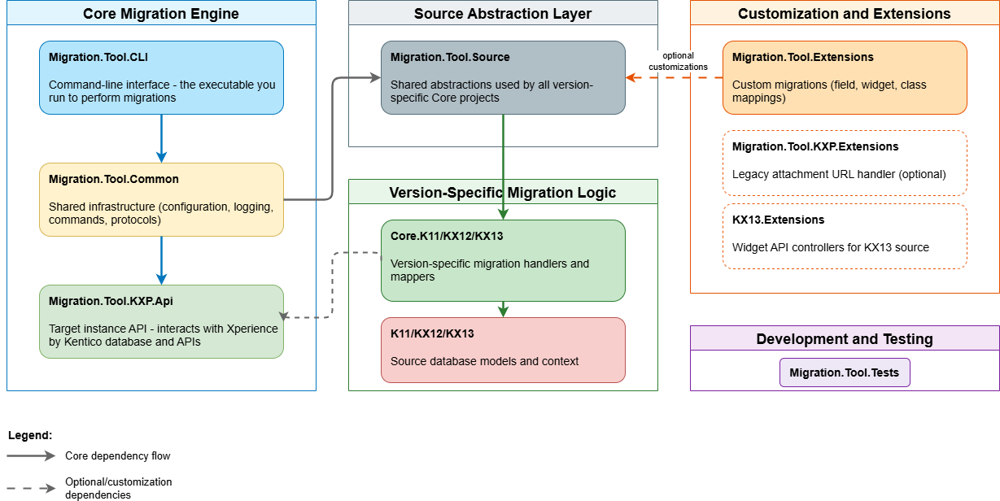

# Repository Structure

> **Audience:** Developers who need to understand how the repository is organized and where to find specific projects.

The repository contains multiple projects that work together to perform migrations. As a migration tool user, you only directly interact with **Migration.Tool.CLI** (to run migrations) and **Migration.Tool.Extensions** (to add customizations). All other projects provide version-specific migration logic that runs automatically based on your source instance version.

## Project Organization

The diagram shows five functional groups:

### Core Migration Engine

The foundation that orchestrates all migrations:

- **Migration.Tool.CLI** - Command-line interface - the executable you run to perform migrations
- **Migration.Tool.Common** - Shared infrastructure (configuration, logging, commands, protocols)
- **Migration.Tool.KXP.Api** - Target instance API - interacts with Xperience by Kentico database and APIs

### Source Abstraction Layer

The bridge between core infrastructure and version-specific implementations:

- **Migration.Tool.Source** - Shared abstractions used by all version-specific Core projects (located in `KVA/` solution folder)

### Version-Specific Migration Logic

Each source version has dedicated projects for migration logic:

- **Migration.Tool.Core.K11** - Kentico 11-specific migration handlers and mappers
- **Migration.Tool.Core.KX12** - Kentico 12-specific migration handlers and mappers
- **Migration.Tool.Core.KX13** - Kentico Xperience 13-specific migration handlers and mappers
- **Migration.Tool.K11** - Kentico 11 source database models and context
- **Migration.Tool.KX12** - Kentico 12 source database models and context
- **Migration.Tool.KX13** - Kentico Xperience 13 source database models and context

### Customization and Extensions

Projects for extending migration behavior:

- **Migration.Tool.Extensions** - Custom migrations (field migrations, widget migrations, class mappings)
- **Migration.Tool.KXP.Extensions** - Handler for legacy attachment URLs to add to target instance after migration (optional)
- **KX13.Extensions** - ASP.NET Core controller for widget API discovery on KX13 source instances
- **KX13.NET48.Extensions** - .NET Framework 4.8 controller for widget API discovery on KX13 source instances

### Development and Testing

Projects for testing and development workflows:

- **Migration.Tool.Tests** - Unit and integration tests for migration logic
- **Tests/** - Automated test configurations and scripts

## Project Dependencies Explained

### CLI → Common → Core
The CLI project depends on Common for shared infrastructure, which depends on the appropriate Core project (K11/KX12/KX13) based on source version.

### Core → Source DB Models
Each Core project (e.g., Migration.Tool.Core.KX13) depends on its corresponding source database model project (e.g., Migration.Tool.KX13) for database access.

### Core → KXP.Api
All Core projects depend on Migration.Tool.KXP.Api to interact with the target Xperience by Kentico instance.

### Extensions (Optional)
The Migration.Tool.Extensions project contains custom migration logic. It compiles as part of the solution and is automatically discovered at runtime. Consult the [Extensions Guide](../Migration.Tool.Extensions/README.md) for detailed instructions on creating field migrations, widget migrations, and custom class mappings.

## Project Modification Guide

| Scenario | Projects to Modify |
|----------|-------------------|
| **Running migrations** | None - configure appsettings.json only |
| **Custom field transformation** | `Migration.Tool.Extensions` |
| **Custom widget migration** | `Migration.Tool.Extensions` |
| **Custom class mapping** | `Migration.Tool.Extensions` |
| **Custom content type relationships** | `Migration.Tool.Extensions` |
| **Contributing bug fixes** | Relevant `Core.KX##` project |
| **Adding new data type support** | `Core.KX##` + `Common` + `CLI` |

## Related Documentation

- **[Extensions README](../Migration.Tool.Extensions/README.md)** - How to customize migrations
- **[Contributing Setup](Contributing-Setup.md)** - For contributors to the tool